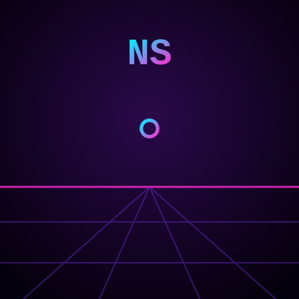

# 🔫 NEON SIEGE

A neon-synthwave **first-person shooter** that runs **entirely on your phone** — no server, no app store, no build step, no dependencies. Just one HTML file with a hand-written raycasting 3D engine, procedural textures, procedural audio, and full touch controls.



## How to play it on your phone (no hosting required)

You have three ways, from easiest to nicest:

### Option A — Open the file directly (truly zero hosting)
1. Get `index.html` onto your phone (AirDrop, email it to yourself, save from a cloud drive, or download from the repo).
2. Tap it to open in your mobile browser. That's it — the whole game runs on-device.
   - *Note:* opened via `file://`, the offline service worker is skipped (browsers block it there), but the game itself still runs 100% locally. Sound starts after you tap **DEPLOY**.

### Option B — GitHub Pages (free, still no backend — it only serves the static file)
1. Push this repo to GitHub.
2. Repo **Settings → Pages → Build from branch →** pick your branch, root folder.
3. Open the given URL on your phone, then tap the browser's **Share → Add to Home Screen**.
4. Now it launches fullscreen like a native app **and works offline** (service worker caches everything after first load).

### Option C — Any tiny local server on your machine, played over Wi-Fi
```bash
cd Uno
python3 -m http.server 8000
# then on your phone (same Wi-Fi): http://<your-computer-ip>:8000
```

## Controls

| Action | Touch (phone) | Desktop |
|--------|---------------|---------|
| Move / strafe | Left-side virtual **joystick** | `W A S D` |
| Look / turn | **Drag** anywhere on the right half | Mouse (click to lock) / `← →` |
| Fire | Red **FIRE** button (hold to auto-fire) | Click / `Space` |

## The game

- **Goal:** survive endless waves of robotic sentinels in the Sector-7 grid.
- **Two enemy types:** cyan grunts and pink heavies (tougher, hit harder).
- Pick up **+HP** (green cross) and **+AMMO** (amber cell) drops scattered each wave.
- Clearing a wave heals you a bit and spawns a bigger one. Chase that high score.
- Live **minimap**, distance fog, muzzle flash, particle hits, and procedural synth SFX.

## Why it's built this way

The engine is a classic **DDA raycaster** (Wolfenstein/Doom-style) rendering into a small
internal pixel buffer that's scaled up for a crisp retro look — this keeps it fast on phones.
Walls, enemies, pickups, the weapon, and all sounds are generated in code, so the entire
experience is a handful of small static files with **no external assets and no server logic**.

## Files
- `index.html` — the entire game (engine, renderer, input, audio, UI)
- `manifest.webmanifest` — makes it installable as a home-screen app
- `sw.js` — service worker for offline play
- `icon.svg` — app icon

Have fun. The sky was the limit. 🌆
